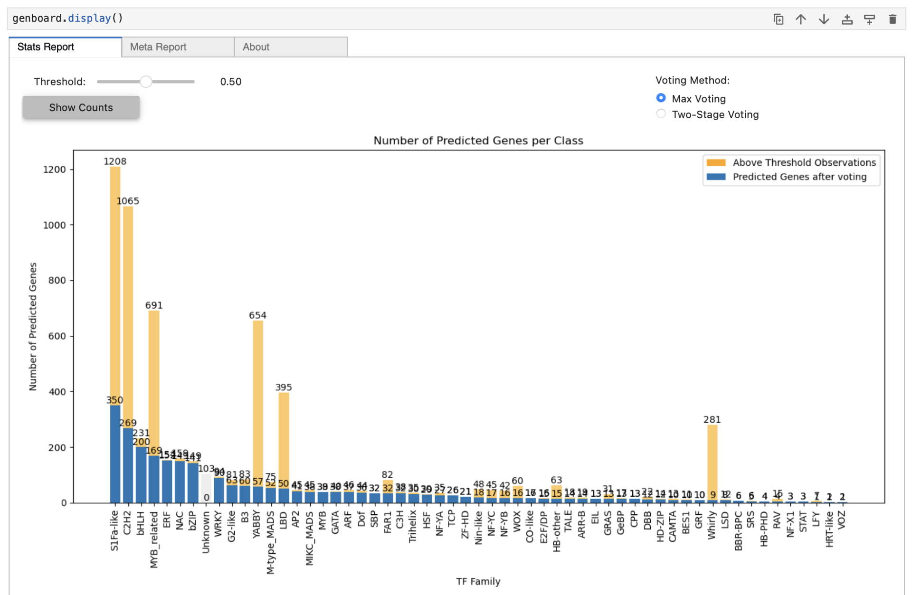

<div align="center" style="">
  <br>
  
  <br>
  <!-- <h1>GeneLM</h1> -->
  MegaPlantTF: a comprehensive machine learning framework for the identification and classification of plant transcription factors.
  <br>
  <br>

  []()
  [](https://huggingface.co/Genereux-akotenou/genomics-tf-prediction)
  [](https://anaconda.org/bioinformatics-um6p/megaplanttf)
</div>

## MegaPlantTF

`MegaPlantTF` is the first machine learning–based framework designed to identify and classify plant transcription factors (TFs) across multiple species. The project leverages curated data from [PlantTFDB](https://planttfdb.gao-lab.org/) and advanced k-mer–based feature representations to train robust, family-specific binary classifiers. With `MegaPlantTF`, you can:

- Predict Transcription Factors: Identify and classify TF families from plant proteomes using pretrained binary and stacking models.
- Comprehensive Evaluation: Generate detailed classification reports with accuracy, precision, recall, F1-score, and confidence thresholds.
- Flexible Inference Options: Apply max-voting or two-stage stacking classifiers for improved family-level predictions.

<br>


#### Step 1: Create & Activate Conda Environment

Open your terminal in the current folder then create the `MegaPlantTF` environment from the provided YAML file.

```bash
cd MegaPlantTF
conda env create -f MegaPlantTF.yml
```

Activate the MegaPlantTF environment.

```bash
conda activate MegaPlantTF
```

#### Step 2: Register Environment in Jupyter
```bash
python -m ipykernel install --user --name MegaPlantTF --display-name "MegaPlantTF"
```


<br>


Before proceeding, make sure you’ve completed **Step 1** and correctly set up the **MegaPlantTF conda environment**.  
In this step, you’ll download the pretrained model weights, copy them to the right folders, and start the prediction workflow.

#### Install Git Large File Storage to be able to download the model weights
```bash
sudo  apt-get install git-lfs
git lfs install
```

#### Download Pretrained Model Weights & testset for lab
```bash
# cd into MegaPlantTF folder if it not the case yet
cd MegaPlantTF

# Download all the binary models in temp folder
tmpdir="$(mktemp -d)"
git lfs clone https://huggingface.co/Genereux-akotenou/genomics-tf-prediction "$tmpdir/repo"

# copy models from temp folder to `models`folder in MegaPlantTF.
rsync -av --delete "$tmpdir/repo/Binary-Classifier/" "./models/Binary-Classifier/"
rsync -av --delete "$tmpdir/repo/MetaClassifier/"   "./models/MetaClassifier/"
rm -rf "$tmpdir"
```

#### Start Jupyter-lab

Once setup is complete, start JupyterLab to explore the example notebooks.
```bash
jupyter-lab
```

#### Identify and classify TFs

You can start directly with the notebook [start/1-Start-With-MegaPlantTF.ipynb](./start/1-Start-With-MegaPlantTF.ipynb) Or, you can create your own Python script or notebook. First, make sure the project’s root directory is added to sys.path

```python
import sys, os
current_directory = os.getcwd()
root_directory = os.path.abspath(os.path.join(current_directory, os.pardir))
sys.path.append(root_directory)
```

Then, import the predictor classes and run inference:
```python
from pretrained.predictor import SingleKModel, MultiKModel

# Example for SingleKModel
kmodel = SingleKModel(kmer_size=3)
kmodel.load("Ach_pep_kiwi.fas", format="fasta")
genboard = kmodel.predict()
genboard.display()
```



<br>
<br>


You can find the results in the `notebook/Output` directory. Here's what you will find:

1. **Model Files**:
    - Located in `notebook/Output/Model` (after training).
    - Inside this directory, you will find folders named after gene families.
    - Each gene family folder contains:
        - Model `.h5` files for various k-mer sizes.
        - `feature_mask.json` files.

2. **Reports**:
    - Located in `notebook/Output/Reports` (after training).
    - Each report is specific to a gene family.
    - Reports include:
        - Model architecture and parameters.
        - Learning curve.
        - Train set class distribution.
        - Classification metrics: F1 score, recall, accuracy, precision.
        - Confusion matrix for each k-mer size.

<br>

##### Build pretrained model

We have to move into notebook folder and execute the python file named `pyrunner`

```bash
cd notebook
```

The python file should look like this. Depending on if we wanna run the program using multiprocess we have to set either `multiprocess=True` or `multiprocess=False`.

```python
import os
import json
import multiprocessing
import papermill as pm

# Utils
def run_notebook(gene):
    input_notebook = "01-approach2_kmer_neural_network.ipynb"
    notebook_name = os.path.splitext(input_notebook)[0]
    gene_ = gene.replace('/', '__')
    output_notebook = f"AutoSave/{notebook_name}-{gene_}.ipynb"

    # Run the notebook with the specified gene
    pm.execute_notebook(
        input_notebook,
        output_notebook,
        parameters=dict(gene_familly=gene),
        timeout=-1,
        kernel_name='pygenomics'
    )

if __name__ == "__main__":
    # List of genes 
    gene_info_path = "../data/gene_info.json"
    with open(gene_info_path, 'r') as json_file:
        gene_info = json.load(json_file)

    # Output directory
    os.makedirs("AutoSave", exist_ok=True)

    # EXEC NATURE
    multiprocess = False

    if multiprocess:
        # Run notebooks concurrently using multiprocessing
        num_processes = multiprocessing.cpu_count()
        print('NUMBER OF PROCESSES: ', num_processes)
        with multiprocessing.Pool(num_processes) as pool:
            pool.map(run_notebook, gene_info.keys())
    else:
        # Run notebooks sequentially
        for gene in gene_info.keys():
            run_notebook(gene)
```

The next step is to run this file then till the program finish

```bash
python pyrunner
```